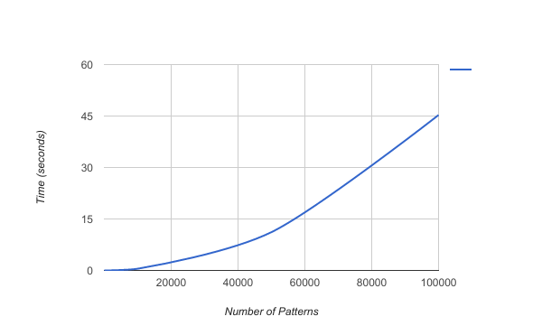
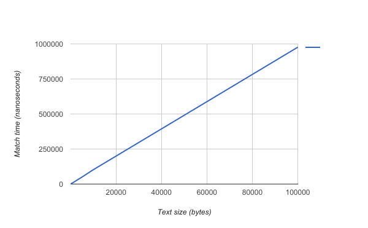

# Aho-Corasick

[](https://travis-ci.com/BobuSumisu/go-ahocorasick)

Aho-Corasick string search algorithm implemented in Go.

Uses a [double array trie](https://linux.thai.net/~thep/datrie/datrie.html) for improved
access speeds and reduced memory consumption.

Licensed under MIT License.

## Documentation

Can be found [here](https://godoc.org/github.com/BobuSumisu/go-ahocorasick).

## Usage


Use a `TrieBuilder` to create a `Trie`:

```go
trie := NewTrieBuilder().
    AddStrings([]string{"hers", "his", "he", "she"}).
    Build()
```

Match something:

```go
matches := trie.MatchString("I have never tasted a hershey bar.")
fmt.Printf("We got %d matches.\n", len(matches))

// => We got 4 matches.
```

Examine matches:

```go
for _, match := range matches {
    fmt.Printf("Matched %q at offset %d.\n", match.Match(), match.Pos())
}

// => Matched "he" at offset 22.
// => Matched "hers" at offset 22.
// => Matched "she" at offset 25.
// => Matched "he" at offset 26.
```

For debugging you may output the trie in DOT format:

```go
NewTrieGrapher(trie).DrawFailLinks(true).Graph("example.dot")
```

And convert to image, e.g.:

```bash
$ dot -Tpng -o example.png example.dot
```


## Building

You can use `ReadStrings` or `ReadHex` to read patterns from a file (one pattern on each line).

```go
patterns, err := ReadStrings("patterns.txt")
if err != nil {
    log.Fatal(err)
}

trie := NewTrieBuilder().AddPatterns(patterns).Build()
```

## Saving/Loading

Building a large trie can take some time:


So you can create a trie and save to file and load it instead of recreating it each time:

```go
err := SaveTrie(trie, "my.trie")
if err != nil {
    log.Fatal(err)
}
```

And later:

```go
trie, err := LoadTrie("my.trie")
if err != nil {
    log.Fatal(err)
}
```

## Performance

Tested on a Dell XPS (i7-6700HQ @ 2.60GHz and 16 GiB RAM).

### Building

    BenchmarkBuildNSF/10-8         	  200000	      11871 ns/op
    BenchmarkBuildNSF/50-8         	   20000	      66552 ns/op
    BenchmarkBuildNSF/100-8        	   10000	     168264 ns/op
    BenchmarkBuildNSF/500-8        	    1000	    2118400 ns/op
    BenchmarkBuildNSF/1000-8       	     200	    6864025 ns/op
    BenchmarkBuildNSF/5000-8       	      10	  126533350 ns/op
    BenchmarkBuildNSF/10000-8      	       2	  504624124 ns/op
    BenchmarkBuildNSF/50000-8      	       1	11154774829 ns/op
    BenchmarkBuildNSF/100000-8     	       1	45294850018 ns/op



As you can see, building gets a bit rough above 10,000 patterns.

### Matching

Using 10,000 patterns.

    BenchmarkMatchIbsen/100-8         	 1000000	      1193 ns/op
    BenchmarkMatchIbsen/500-8         	  300000	      5279 ns/op
    BenchmarkMatchIbsen/1000-8        	  200000	      9704 ns/op
    BenchmarkMatchIbsen/5000-8        	   30000	     49823 ns/op
    BenchmarkMatchIbsen/10000-8       	   20000	    102436 ns/op
    BenchmarkMatchIbsen/50000-8       	    3000	    490882 ns/op
    BenchmarkMatchIbsen/100000-8      	    2000	    976724 ns/op



Matching follows the input more linearly and is quite fast.

### Memory usage

Haven't tested this properly, but a quick test with 10,000 patterns gave Trie with size 99830
(that is, the length of all its slices combined). This should in theory equal around 0.76MiB.
I do not know the internals of golang enough to know how this is in practice.

The memory usage is (obviously) higher when actually doing matching.
