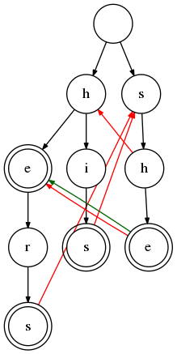

# Aho-Corasick

Aho-Corasick string search algorithm implemented in Go.

Uses a [double array trie](https://linux.thai.net/~thep/datrie/datrie.html) for improved
access speeds and reduced memory consumption.

## Usage

Use a `TrieBuilder` to create a `Trie`:

	trie := NewTrieBuilder().
		AddStrings([]string{"hers", "his", "he", "she"}).
		Build()

Match something:

	matches := trie.MatchString("I have never tasted a hershey bar.")

	fmt.Printf("We got %d matches.\n", len(matches))
	for _, match := range matches {
		fmt.Printf("Matched %q at offset %d.\n", match.Match(), match.Pos())
	}

For debugging you may output the trie in DOT format:

	NewTrieGrapher(trie).DrawFailLinks(true).Graph("example.dot")

And convert to image, e.g.:

    $ dot -Tpng -o example.png example.dot

