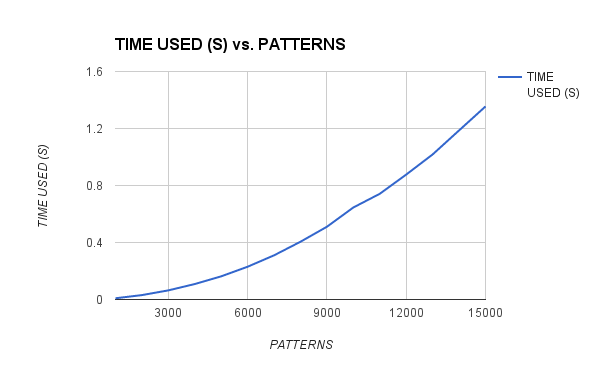

# Aho-Corasick

Aho-Corasick string search algorithm implemented in Go.

Uses a [double array trie](https://linux.thai.net/~thep/datrie/datrie.html) for improved
access speeds and reduced memory consumption.

## Documentation

Can be found [here](https://godoc.org/github.com/BobuSumisu/go-ahocorasick).

## Usage


Use a `TrieBuilder` to create a `Trie`:

```go
trie := NewTrieBuilder().
    AddStrings([]string{"hers", "his", "he", "she"}).
    Build()
```

Match something:

```go
matches := trie.MatchString("I have never tasted a hershey bar.")
fmt.Printf("We got %d matches.\n", len(matches))

// => We got 4 matches.
```

Examine matches:

```go
for _, match := range matches {
    fmt.Printf("Matched %q at offset %d.\n", match.Match(), match.Pos())
}

// => Matched "he" at offset 22.
// => Matched "hers" at offset 22.
// => Matched "she" at offset 25.
// => Matched "he" at offset 26.
```

For debugging you may output the trie in DOT format:

```go
NewTrieGrapher(trie).DrawFailLinks(true).Graph("example.dot")
```

And convert to image, e.g.:

```bash
$ dot -Tpng -o example.png example.dot
```


## Building

You can use `ReadStrings` or `ReadHex` to read patterns from a file (one pattern on each line).

```go
patterns, err := ReadStrings("patterns.txt")
if err != nil {
    log.Fatal(err)
}

trie := NewTrieBuilder().AddPatterns(patterns).Build()
```

## Saving/Loading

Building a large trie can take some time:



So you can create a trie and save to file and load it instead of recreating it each time:

```go
err := SaveTrie(trie, "my.trie")
if err != nil {
    log.Fatal(err)
}
```

And later:

```go
trie, err := LoadTrie("my.trie")
if err != nil {
    log.Fatal(err)
}
```
